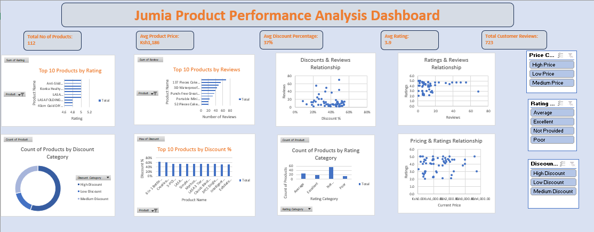
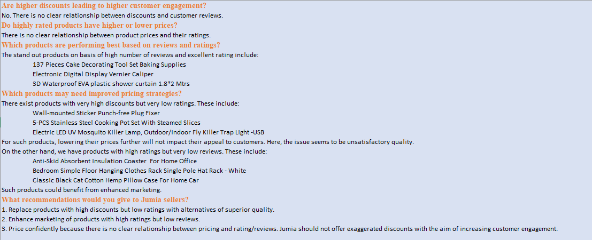

# Interactive Excel Dashboard for E-commerce Product Analysis: A Case Study of Jumia Products
Data analysis is crucial for informed decision-making in the e-commerce sector. Jumia is one of the leading e-commerce platforms in Africa. The multi-national corporation operates an online marketplace that links sellers with buyers. Jumia features an enormous range of items with diverse prices and discounts. Usually, customers browse Jumia’s website and make online purchases by adding items of choice to a virtual card and then making payments through a safe digital checkout. Additionally, the website allows buyers to give quantitative scores (ratings) and qualitative feedback (reviews) about products purchased. For this project, the goal was to use Microsoft Excel to analyze a dataset comprising items listed on Jumia with the aim of understanding how pricing, discounts, and customer engagement affect product performance. In the end, the dishboard below was arrived at: 
## Dashboard Preview

## Project Overview
The project entailed analysis of a raw Excel sheet containing Jumia products data. The data was cleaned, enriched, prepared, and then analysed as shown [here](Analysis.xlsx).
## Dashboard Features
- Total Number of Products, Average Product Price, Average Discount Percentage, Average Ratings, Total Customer Reviews
- Relationships between:
    - Discount and Reviews
    - Ratings and Reviews
    - Rating and Pricing
- Highest Rated Products
- Products with the Most Reviews
- Discount Categories and Number of Products Falling in Each Category
- Slicers for:
  - Price Category
  - Rating Category
  - Discount Category
## Business Insights
From the analysis using PivotTables, charts, and slicers, the insights below were arrived at. 

## Files Included
|File           |Description                                                                                   |
|---------------|----------------------------------------------------------------------------------------------|
|Analysis.xlxs  |Excel workbook containing sheets: raw data, cleaned data, pivot tables, diverse analysis steps| 
|Dashboard.PNG  |Image showing final product performance dashboard                                             |
|Insights.PNG   |Image showing insights derived from the analysis                                              |
## How to Download and Use
1. Download the [Excel workbook](Analysis.xlsx).
2. Open it using Microsoft Excel.
3. Go to the Dashboard worksheet.
4. Use Price Category, Rating Category, and Discount Category slicers to explore results.
## Tools Used
- Microsoft Excel
- Excel Formulas
- PivotTables
- PivotCharts
- Slicers
